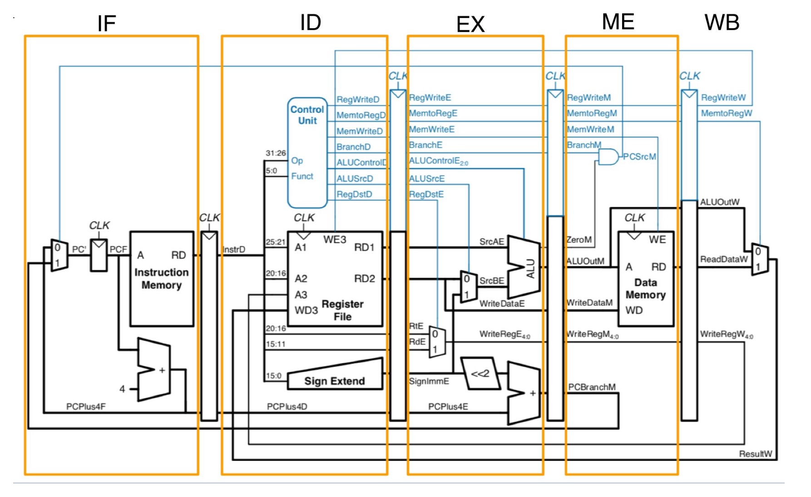
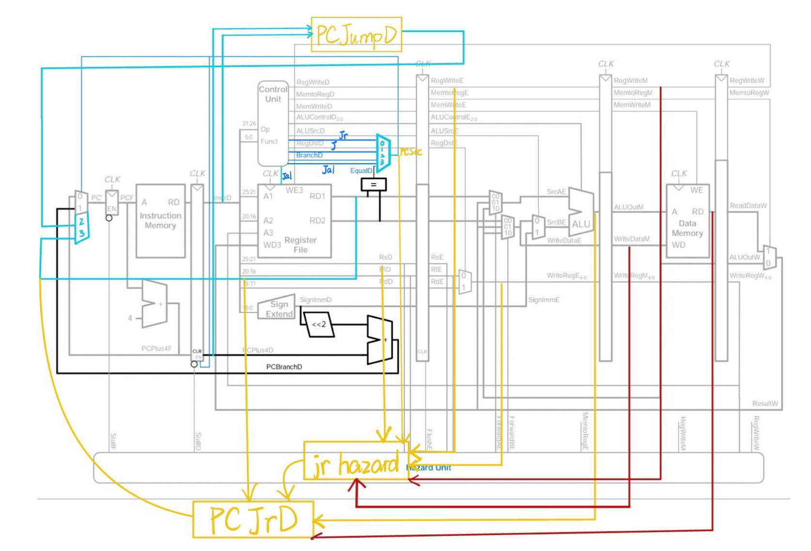

# 5-stage pipeline CPU

## Project Overview

This project focuses on implementing a 5-stage pipeline CPU using Verilog language. It aims to achieve efficient data processing by simultaneously operating five stages: Instruction Fetching (IF), Instruction Decoding (ID), Executing (EX), Memory Access (MEM), and Write Back (WB). The project also integrates four pipelines for data storage and transposition. You can find more details about the project in the [Description](./Description.pdf).

## Key Features

- **5-Stage Pipeline**: IF, ID, EX, MEM, and WB stages for improved processing speed.



- **Hazard Management**: Solutions for 7 different hazards to ensure accuracy and minimize operation time.




## Implementation Details

- **Modular Design**: The CPU is divided into 9 modules: IF, IFID_Registers, ID, IDEX_Registers, EX, EXMME_Registers, ME, MEWB_Registers, and WB.
- **Hazard Solutions**: Implementation of strategies to address hazards like MEM/WB_to_EX, lw_stall, Register_read_write, Beq_Bne, J/Jal/Jr, Jr, and Beq_bne hazards.

## Setup and Testing

```
make CPU
```
